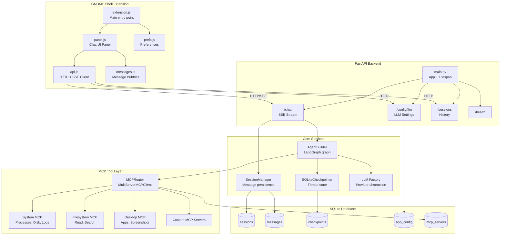
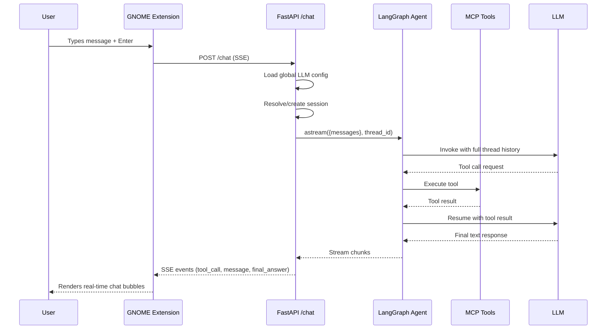
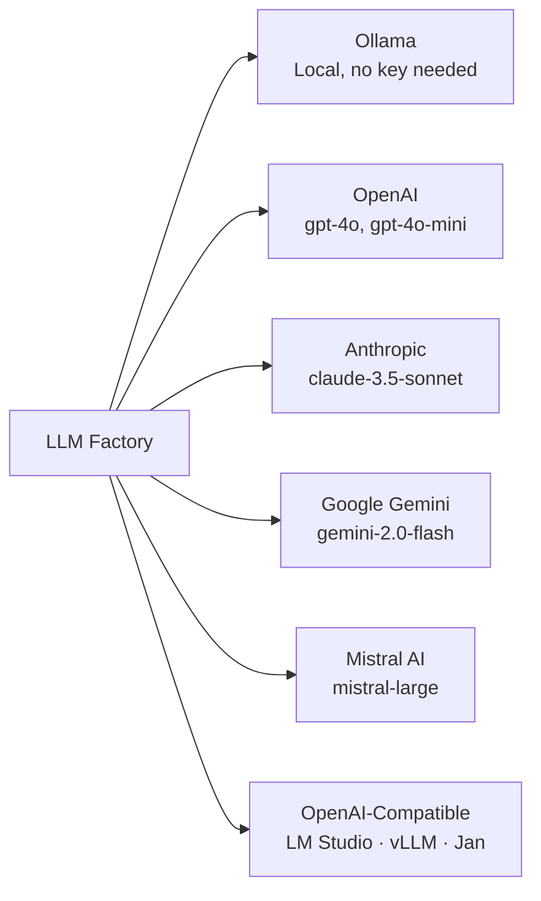

# 🤖 Gnome Agent

> A **local-first AI assistant** embedded directly into your GNOME desktop — powered by LangGraph and MCP tool integration.

[](https://python.org)
[](https://fastapi.tiangolo.com)
[](https://python.langchain.com/docs/langgraph)
[](https://gnome.org)
[](LICENSE)

---

## ✨ Features

| Feature | Description |
|---|---|
| 🧠 **Multi-provider LLM** | Ollama, OpenAI, Anthropic, Gemini, Mistral, or any OpenAI-compatible server |
| 🔧 **MCP Tool Integration** | Model Context Protocol for extensible desktop tools (filesystem, system, custom) |
| 💬 **Persistent Chat History** | SQLite-backed LangGraph checkpointer — conversations survive server restarts |
| ⌨️ **Global Hotkey** | Press `Super+Space` anywhere to summon the AI panel |
| 🪟 **Resizable Panel** | Drag the corner handle to resize. Size is persisted across sessions |
| 🕐 **Chat History Browser** | Browse and resume previous conversations from the history overlay |
| ⚙️ **In-UI LLM Config** | Configure your provider, model, and API key directly in preferences |
| 📡 **SSE Streaming** | Real-time token-by-token streaming in the chat panel |
| 🔒 **Optional Auth** | Bearer token auth and per-IP rate limiting middleware |
| 🖥️ **Context Injection** | Active app, window title, and clipboard injected into the AI context |

---

## 🎥 Demo

> Watch the assistant in action:

https://github.com/mrankitvish/gnome-agent/raw/main/docs/gnome-agent-demo.webm

---

## 🏗️ Architecture

### System Overview



### Chat Message Flow



### LLM Provider Support



---

## 📁 Project Structure

```
gnome-agent/
├── app/                        # FastAPI backend
│   ├── main.py                 # App factory + lifespan
│   ├── config.py               # Pydantic settings
│   ├── api/
│   │   ├── chat.py             # POST /chat (SSE streaming)
│   │   ├── config.py           # GET/PUT /config/llm
│   │   ├── sessions.py         # GET /sessions, /sessions/{id}/messages
│   │   ├── mcp.py              # MCP server management
│   │   └── health.py           # GET /health
│   ├── core/
│   │   ├── agent_builder.py    # LangGraph agent factory + cache
│   │   ├── llm_factory.py      # Multi-provider LLM initialization
│   │   ├── checkpointer.py     # SQLite-backed LangGraph checkpointer
│   │   ├── session_manager.py  # Chat session + message persistence
│   │   └── permissions.py      # Tool permission system
│   ├── db/
│   │   ├── database.py         # Async SQLite connection manager
│   │   └── models.py           # Schema DDL + seed data
│   └── mcp/
│       ├── client.py           # MultiServerMCPClient wrapper
│       ├── registry.py         # Tool registry
│       └── builtins/           # Built-in MCP servers
│           ├── system.py       # Processes, disk, journal
│           ├── filesystem.py   # File read/search
│           └── desktop.py      # App launcher, screenshot
│
├── extension/                  # GNOME Shell Extension
│   ├── extension.js            # Entry point, hotkey binding
│   ├── panel.js                # Chat popup UI
│   ├── prefs.js                # Preferences window
│   ├── api.js                  # HTTP/SSE API client (Soup3)
│   ├── messages.js             # Message bubble widgets
│   ├── metadata.json           # Extension manifest
│   ├── stylesheet.css          # Custom styles
│   ├── icon.png                # Panel icon
│   ├── install.sh              # One-command installer
│   └── schemas/                # GSettings schema
│
├── docs/                       # Documentation
│   ├── setup.md                # Installation & configuration
│   └── how-to-guide.md         # Feature usage guide
│
├── gnome-agent.service         # Systemd user service
├── pyproject.toml              # Python project manifest
└── .env.example                # Environment variable template
```

---

## 🚀 Quick Start

```bash
# 1. Clone
git clone https://github.com/mrankitvish/gnome-agent
cd gnome-agent

# 2. Install backend
python -m venv venv && source venv/bin/activate
pip install -e .

# 3. Configure
cp .env.example .env
# Edit .env with your LLM settings

# 4. Start server
uvicorn app.main:app

# 5. Install GNOME extension
bash extension/install.sh
# Restart GNOME Shell (Alt+F2, r, Enter on X11)
```

👉 **Full setup instructions**: [docs/setup.md](docs/setup.md)
👉 **Feature usage guide**: [docs/how-to-guide.md](docs/how-to-guide.md)

---

## 🔌 API Overview

| Method | Endpoint | Description |
|---|---|---|
| `POST` | `/chat` | Stream AI response as SSE |
| `GET` | `/config/llm` | Get current LLM config + capabilities |
| `PUT` | `/config/llm` | Update global LLM config |
| `GET` | `/config/providers` | List all supported providers |
| `GET` | `/sessions` | List all conversation sessions |
| `GET` | `/sessions/{id}/messages` | Get messages for a session |
| `GET` | `/health` | Runtime health check |
| `GET/POST` | `/mcp/servers` | Manage MCP servers |
| `GET` | `/tools` | List loaded MCP tools |

---

## 🛡️ Requirements

- **OS**: Linux with GNOME Shell 45+
- **Python**: 3.11+
- **LLM**: Any supported provider (Ollama recommended for local use)

---

## 📄 License

MIT © 2026 — see [LICENSE](LICENSE)
